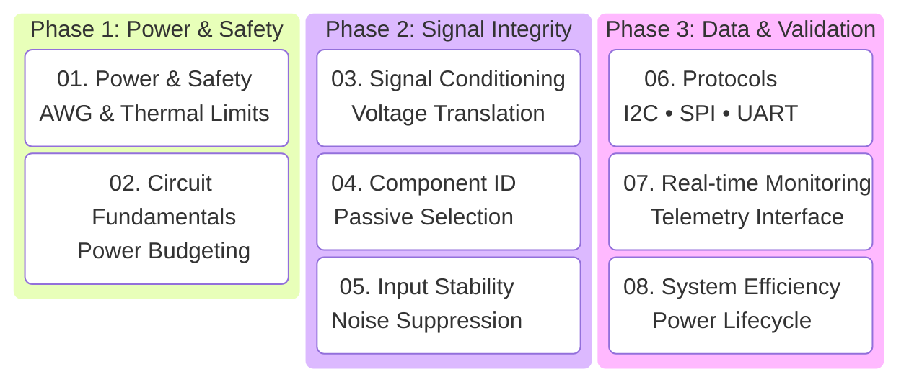

# Embedded Systems Design: A Hands-on Guide

This course bridges the gap between hobbyist "plug-and-play" electronics and professional **Embedded Systems Engineering**. We focus on building robust, calculated, and diagnostic-ready hardware.

> **Course Philosophy:** We don't guess. We calculate, we simulate, and we monitor.

---

## 🛠️ The Curriculum (The Engineering Path)

The course is structured to follow the real-world development cycle of a high-performance embedded device.

---

## 🧪 Targeted Outcomes
By the end of this course, you will be able to design a front-end for a **30kV electrospinning system** (or any high-power project) that doesn't just "work," but is electrically stable, thermally safe, and ready for real-time telemetry.

[**Start Chapter 1: Power & Safety →**](01-power-safety/)