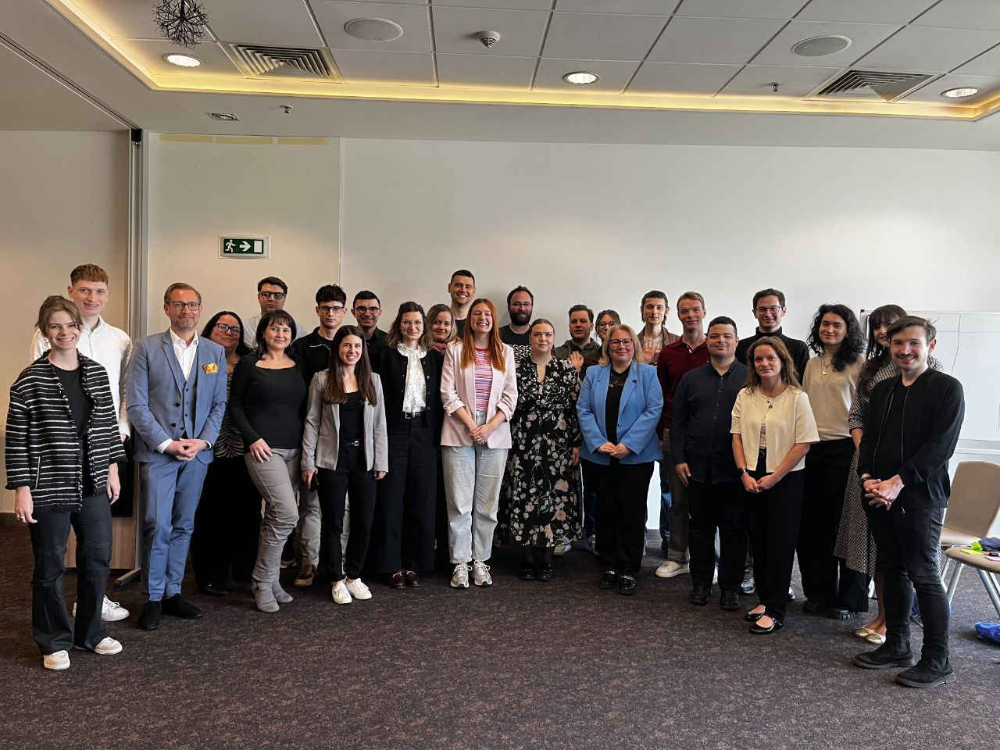
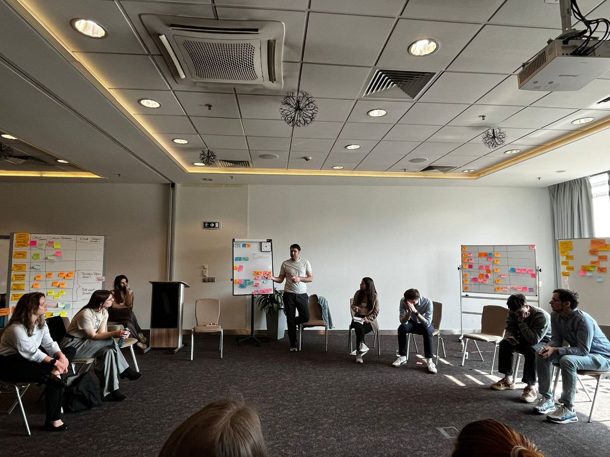
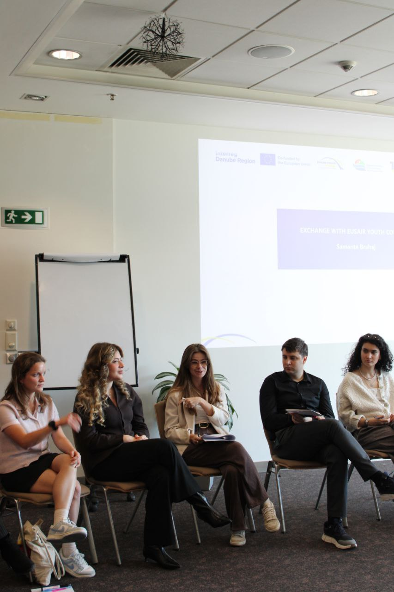
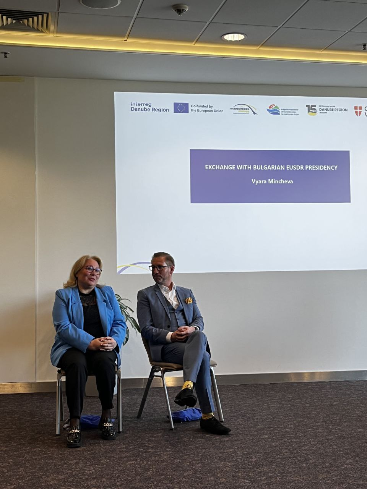
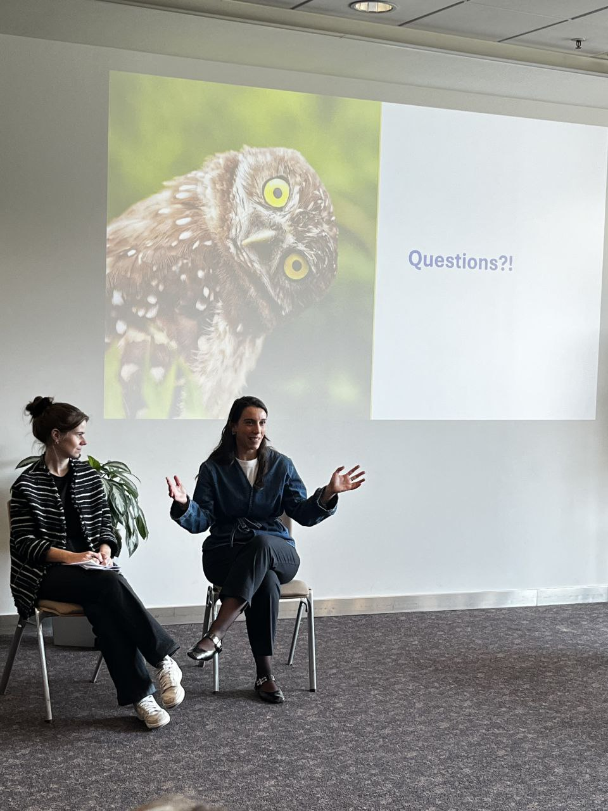
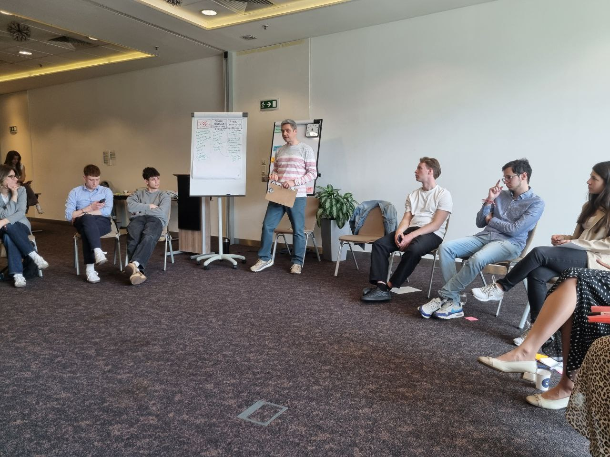
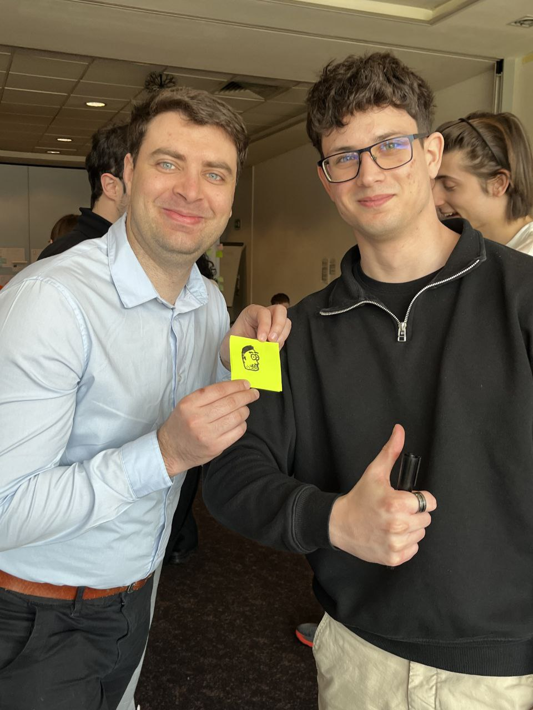
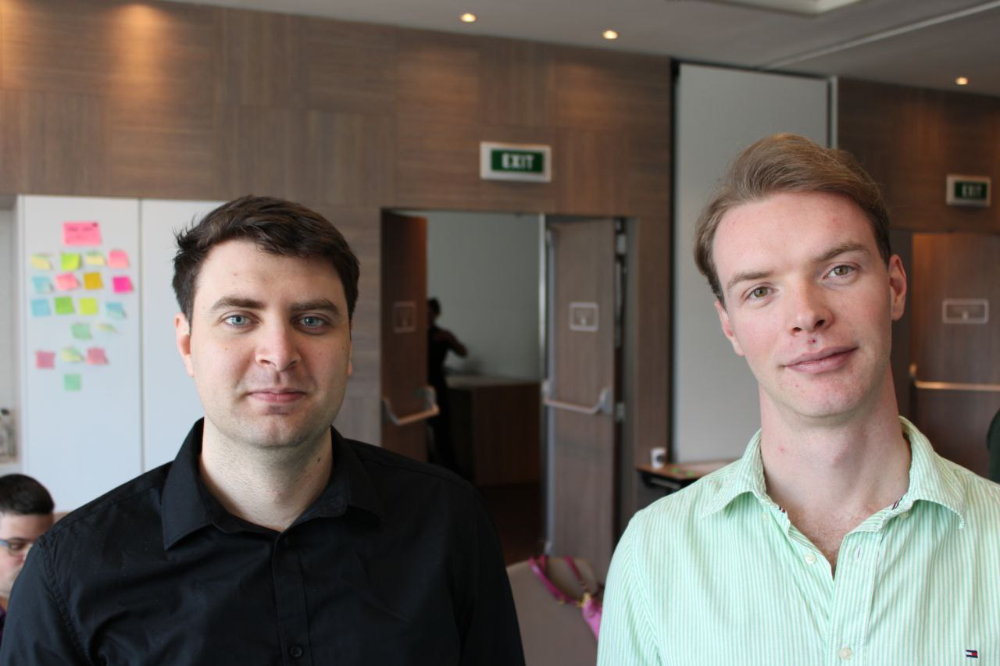

## Context: Understanding DYC and the EUSDR Framework

The **EU Strategy for the Danube Region (EUSDR)** is a macro-regional strategy involving 14 countries. To ensure effective governance, it operates through a structured hierarchy consisting of Priority Areas (PA), a Secretariat, and a rotating Presidency—currently held by **Bulgaria**.

The **DYC (Danube Youth Council)** acts as the official youth advisory body to these structures.

### The Role of a Spokesperson
As the **Spokesperson** for the DYC, my responsibility extends beyond communication. I am tasked with ensuring the council's internal structure is robust and that our collective voice is translated into actionable policy recommendations. You can find the full [list of DYC members and representatives here](https://danube-region.eu/danube-youth-council/).

*Defining internal rules and communication protocols for the council.*

---

## Event Journal: March 15 - 17, Sofia

### Day 1: Macro-regional Cooperation
We explored synergies between EU regions, discussing best practices with **Samanta Brahaj** from the **EUSAIR Youth Council**.

### Day 2: High-Level Policy Dialogue
We engaged with key decision-makers including **Vyara Mincheva** (Bulgarian Presidency) and **Elisa Cocco** (DG REGIO, European Commission) to align youth initiatives with EU financial instruments.

### Day 3: Sustainability and Local Impact
Working with **Lyuben Georgiev**, we focused on transforming high-level policy into social and environmental impact for local Danube communities.

---

## Why This Role Matters

Participating in the Sofia session reaffirmed that youth are not just beneficiaries of EU policies, but active architects of them. As an engineer focused on R&D, I believe our voice in the **DYC** is vital for bringing a pragmatic, technical perspective to European legislative processes.

---

### Additional Resources
* **Official Website:** Stay updated with [EUSDR events and initiatives](https://danube-region.eu/).
* **Event Materials:** Detailed schedule available in the PDF link at the top.

