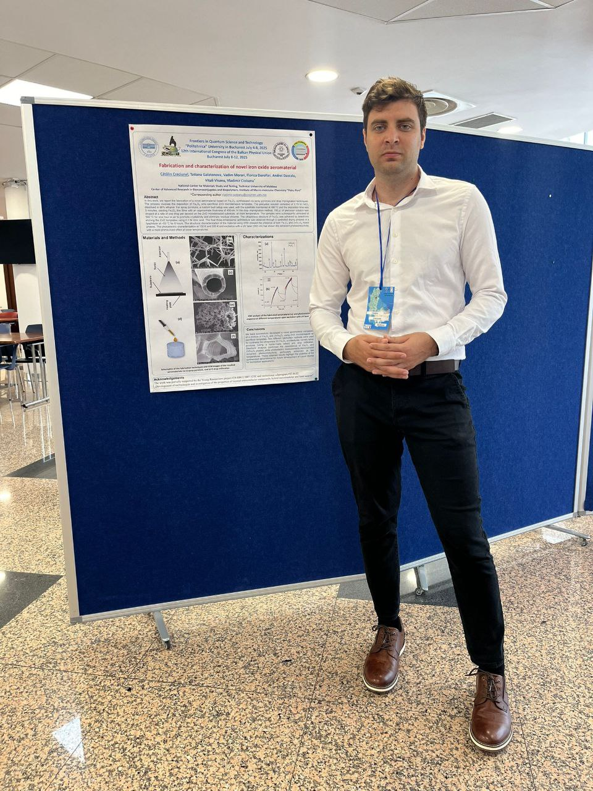
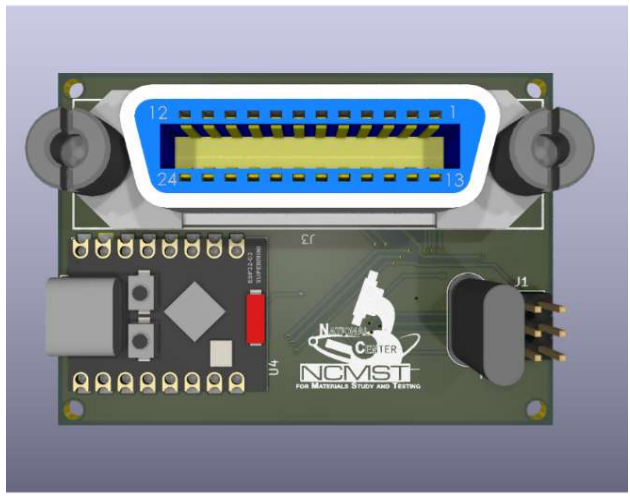

  

  <!-- STAGE 1: Project Conclusion (Dec 2025) -->
  

      

      

        <i class="fas fa-check-circle"></i> December 2025 • Completed
        <h3 class="timeline-heading">Project Finalization & Results Delivery</h3>
        

          Successfully concluded the 1.5-year research project funded by the National Agency for Research and Development (ANACED). Delivered validated protocols for high-porosity 3D aeromaterial templates and published findings in international congresses.
        

      

    

  <!-- STAGE 2: MacroYouth 2025 Conference -->
  

      

      

        <i class="fas fa-award"></i> Conference Milestone
        <h3 class="timeline-heading"><a href="https://creciunel.github.io/publications/macroyouth-2025-poster/">MacroYouth 2025 Presentation</a></h3>
        

          Showcased advanced optical and structural characterization data of synthesized Fe₃O₄ aeromaterial structures in Iași, receiving the 3rd Prize for Best Poster Presentation.
        

        

          
        

      

    

  <!-- STAGE 3: BPU12 Congress -->
  

      

      

        <i class="fas fa-globe"></i> International Dissemination
        <h3 class="timeline-heading"><a href="https://creciunel.github.io/publications/bpu12-congress/">BPU12 Congress (Bucharest)</a></h3>
        

          Presented research findings on quantum frontiers and fabrication protocols for novel iron oxide nanonetworks (Fe₃O₄ / Fe₂O₃) during the 12th International Conference of the Balkan Physical Union.
        

        

          
        

      

    

  <!-- STAGE 4: Hardware & Instrumentation Automation -->
  

      

      

        <i class="fas fa-microchip"></i> Automation Milestone
        <h3 class="timeline-heading"><a href="https://creciunel.github.io/publications/gpib-laboratory-instruments/">GPIB Instrumentation Setup</a></h3>
        

          Developed automated embedded control systems and GPIB interface software to replace manual laboratory steps, ensuring repeatable environmental control during electrochemical and thermal redox cycles.
        

        

          
        

      

    

  <!-- STAGE 5: Project Initiation & Team (July 2024) -->
  

      

      

        <i class="fas fa-flag"></i> July 2024 • Project Launch
        <h3 class="timeline-heading">Project Initiation (#24.80012.5007.12TC)</h3>
        

          Official kickoff of the Young Researchers Project at the National Center for Materials Study and Testing (NCMST). Initiated phase stabilization studies for magnetite (Fe₃O₄), hematite (Fe₂O₃), and ultra-lightweight GaN porous templates.
        

        

          
<i class="fas fa-user-tie"></i> Management & Expert Guidance:

          <ul>
            <li><strong>Vladimir Ciobanu</strong> – Project Manager</li>
            <li><strong>Tudor Braniște</strong> – Scientific Expert</li>
          </ul>
          
<i class="fas fa-users-cog"></i> Engineering Team:

          <ul style="margin-bottom: 0;">
            <li>Cătălin Creciunel</li>
            <li>Tatiana Maslova</li>
            <li>Simon Busuioc</li>
          </ul>
        

      

    

  

