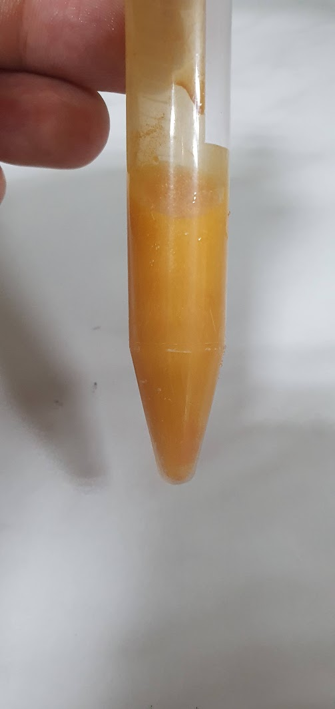

  

  <!-- STAGE 1: Upcoming Event (2026) -->
  

      

      

        <i class="fas fa-calendar-alt"></i> Upcoming • 2026
        <h3 class="timeline-heading"><a href="https://mscmp.usm.md/" target="_blank">Presentation at MSCMP 2026</a></h3>
        

          Scheduled to present results on 2D nanomaterial functionalization and liquid-phase exfoliation parameters at the International Conference on Materials Science and Condensed Matter Physics. Programme details on <a href="https://mscmp.usm.md/wp-content/uploads/p/MSCMP2026_Programme_web.pdf" target="_blank">MSCMP 2026 Official Programme</a>.
        

      

    

  <!-- STAGE 2: Recent Conference with Video -->
  

      

      

        <i class="fas fa-bullhorn"></i> Conference Milestone
        <h3 class="timeline-heading"><a href="https://creciunel.github.io/events/isydma10/">Participation at ISYDMA'10</a></h3>
        

          Presented core findings regarding photocatalytic behavior and structural features of ultrasonic-exfoliated SnS/SnS₂ nanosheets.
        

        <video controls preload="metadata" class="timeline-video">
          <source src="/events/isydma10/Poster_presentation.mp4" type="video/mp4">
          Your browser does not support the video tag.
        </video>
      

    

  <!-- STAGE 3: Hardware Engineering -->
  

      

      

        <i class="fas fa-microchip"></i> Hardware Engineering
        <h3 class="timeline-heading">Automated Sonication System Development</h3>
        

          Designed custom ultrasound setup with precise PWM timing and active thermal regulation to optimize acoustic shear stress while preserving nanosheet crystal structure.
        

        

          
        

      

    

  <!-- STAGE 4: Materials Analysis -->
  

      

      

        <i class="fas fa-atom"></i> Material Diagnostics
        <h3 class="timeline-heading">SnS & SnS₂ Chalcogenide Profiling</h3>
        

          Investigated optical bandgap profiles (SnS: 1.1–1.3 eV, SnS₂: 2.1–2.4 eV) for targeted solar absorption and organic pollutant degradation under visible light.
        

      

    

  <!-- STAGE 5: Project Initiation & Team -->
  

      

      

        <i class="fas fa-flag"></i> August 2025 • Launch
        <h3 class="timeline-heading">Project Initiation (#25.80012.5007.38TC)</h3>
        

          Kickoff of the Young Researchers Project at NCMST. Formulated foundational protocols for 2D chalcogenide liquid-phase exfoliation.
        

        

          
<i class="fas fa-user-tie"></i> Management & Scientific Supervision:

          <ul>
            <li><strong>Andrei Tiron</strong> – Project Manager</li>
            <li><strong>Vladimir Ciobanu</strong> – Scientific Expertise Lead</li>
          </ul>
          
<i class="fas fa-users-cog"></i> Engineering Team:

          <ul style="margin-bottom: 0;">
            <li>Tatiana Galatonova</li>
            <li>Cătălin Creciunel</li>
            <li>Alin Mamoico</li>
          </ul>
        

      

    

  

