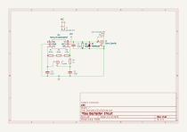
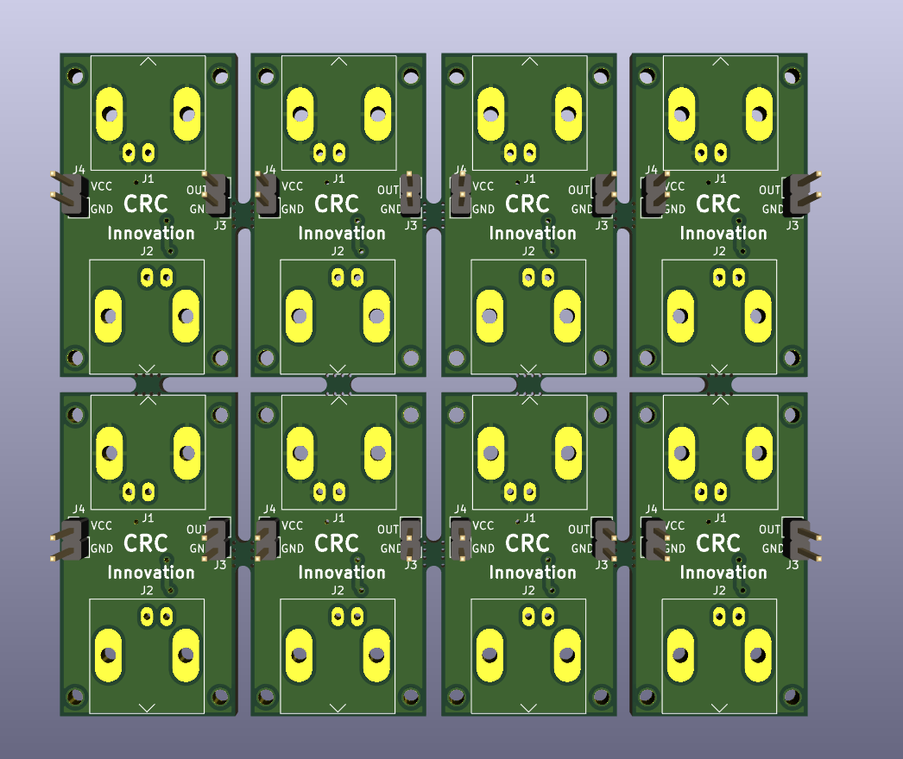
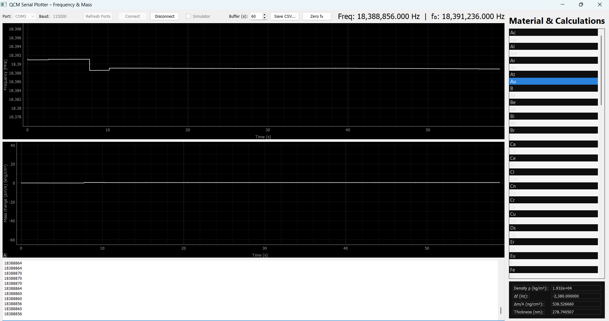
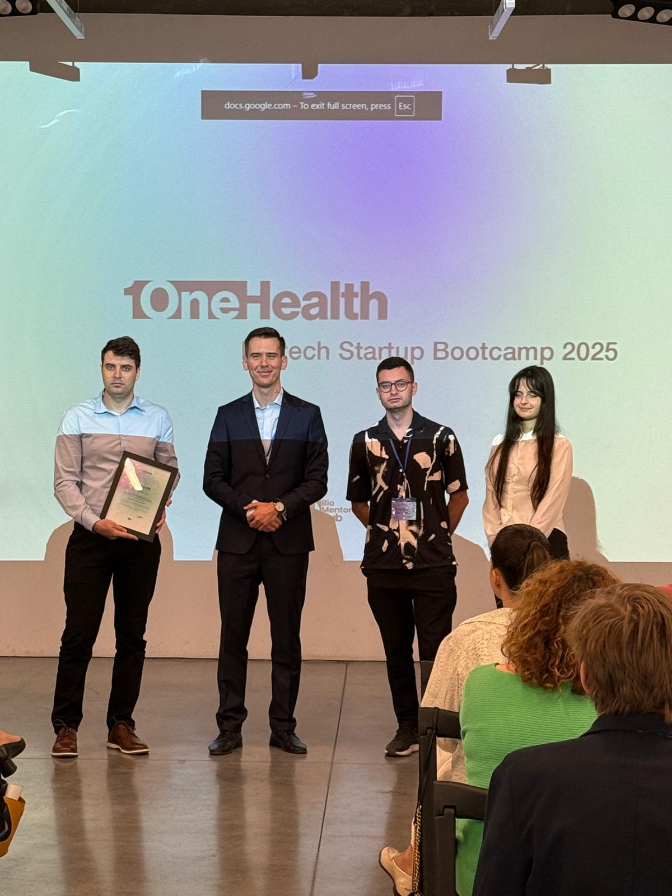
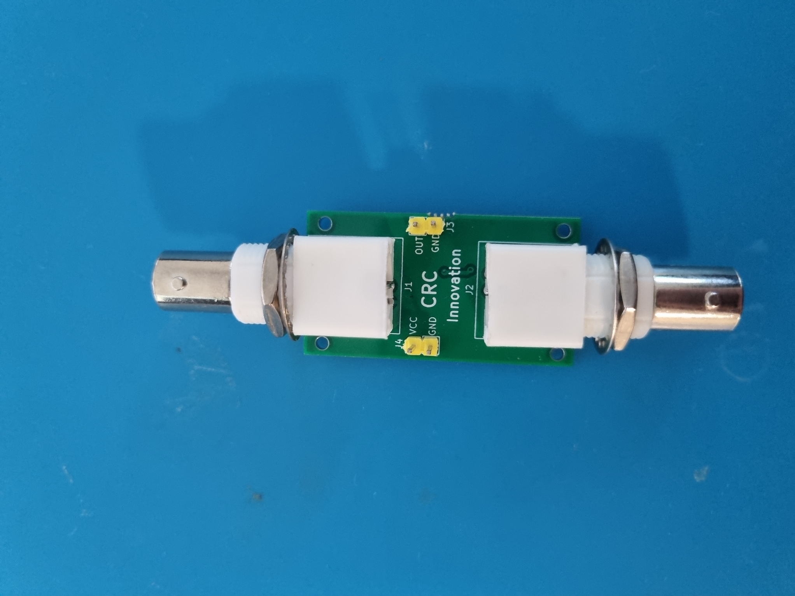

  

<!-- STAGE 1: Concept & Stuttgart Inception (May 2025) -->

      

      

        <i class="fas fa-lightbulb"></i> May 2025 • Stuttgart
        <h3 class="timeline-heading">Project Conception & Goal</h3>
        

          Initiated the QCM project in Stuttgart with the core objective of building a precise quartz crystal microbalance device capable of measuring the thickness of metal layers deposited via PVD technology.
        

      

    

<!-- STAGE 2: Oscilloscope Tests & Initial Schematics (June - July 2025) -->

      

      

        <i class="fas fa-wave-square"></i> June - July 2025 • Validation
        <h3 class="timeline-heading">Oscilloscope Testing & Circuit Design</h3>
        

          Conducted initial oscillator circuit tests using an oscilloscope without an MCU. Designed the oscillator schematic using the SN74LVC1G04DCKR driver for accurate frequency measurement.
        

        

          
          
        

      

    

<!-- STAGE 3: PCB Fabrication & ESP32-S3 Integration (August 2025) -->

      

      

        <i class="fas fa-microchip"></i> August 2025 • Hardware Realization
        <h3 class="timeline-heading">PCB Ordering & ESP32-S3 Integration</h3>
        

          Selected the ESP32-S3 microcontroller to handle data processing and integrated the SN74LVC1G04 driver. Ordered the custom PCB from JLCPCB and verified mechanical dimensions and 3D models.
        

        

          
          
          
        

      

    

<!-- STAGE 4: Desktop App & 1health Biotech Bootcamp (September 2025) -->

      

      

        <i class="fas fa-desktop"></i> September 2025 • Software & Ecosystem
        <h3 class="timeline-heading">Desktop Application & Bootcamp</h3>
        

          Developed the desktop application interface (by Andrei Copaceanu) to visualize frequency shifts and layer thickness. Participated in the <a href="https://creciunel.github.io/blog/1health-biotech-bootcamp/" target="_blank">1health Biotech Bootcamp</a> to showcase technical implementations.
        

        

          
          
        

      

    

<!-- STAGE 5: Hardware Prototyping & Final Testing -->

      

      

        <i class="fas fa-flask"></i> Testing & Results
        <h3 class="timeline-heading">Prototype Assembly & Final Testing</h3>
        

          Assembled the physical prototype, tested crystal oscillation performance with the custom hardware board, and validated overall system integration.
        

        

          
        

        

          <video controls width="100%" style="border-radius: 10px; border: 1px solid rgba(156, 163, 175, 0.4);">
            <source src="test.mp4" type="video/mp4">
            Your browser does not support the video tag.
          </video>
        

      

    

  

