

  

  <!-- STAGE 1 -->
  

      

      

        <i class="fas fa-exclamation-triangle"></i> Lab Challenge • Legacy Setup
        <h3 class="timeline-heading">Manual Thermal Oxidation Limitations</h3>
        

          Semiconductor nanostructure synthesis required strict thermal profiles. The original 800W thermal reactor operated with manual LATR autotransformer control and no closed-loop feedback, leading to human error and inconsistent soak times.
        

        

          <a href="TermalReactor2.jpg" data-fancybox="stage-1">
            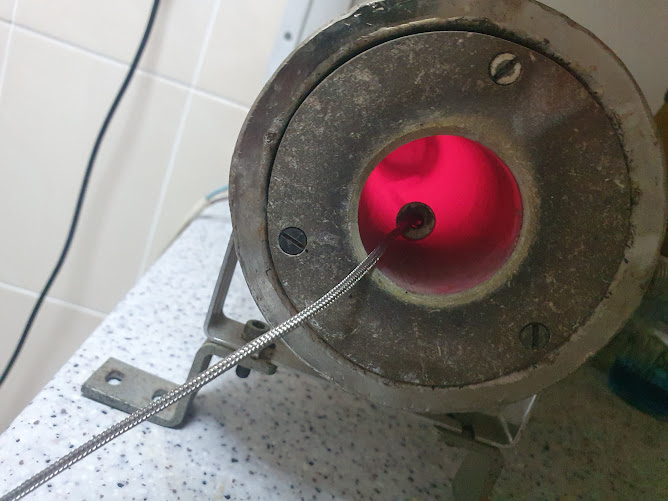
          </a>
          <a href="TermalReactor.jpg" data-fancybox="stage-1">
            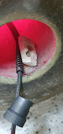
          </a>
          <a href="InitialTemperatureMasurment.jpg" data-fancybox="stage-1">
            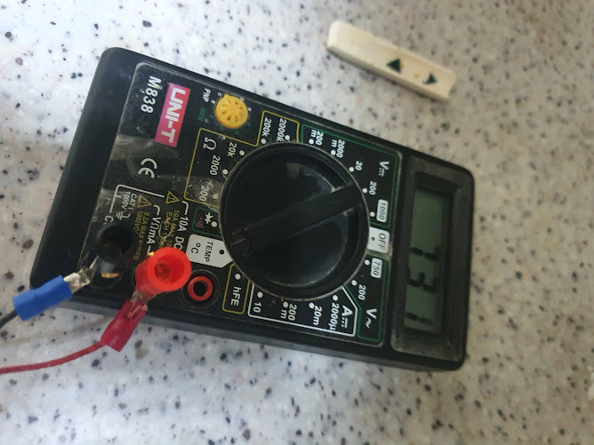
          </a>
        

      

    

  <!-- STAGE 2 -->
  

      

      

        <i class="fas fa-tools"></i> Hardware Iteration 1 & 2
        <h3 class="timeline-heading">Perfboard Prototyping & In-House Etching</h3>
        

          Engineered Prototypes 1 & 1B on perfboard to validate zero-crossing triac drivers and thermocouple conditioning. Designed and etched Prototype No. 2 double-sided PCB in-house via thermal toner transfer to reduce analog noise.
        

        

          <a href="PrototipeNr1A.jpg" data-fancybox="stage-2">
            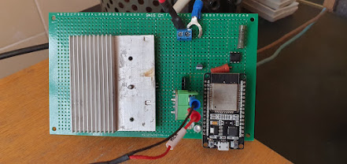
          </a>
          <a href="prototipN1B.jpg" data-fancybox="stage-2">
            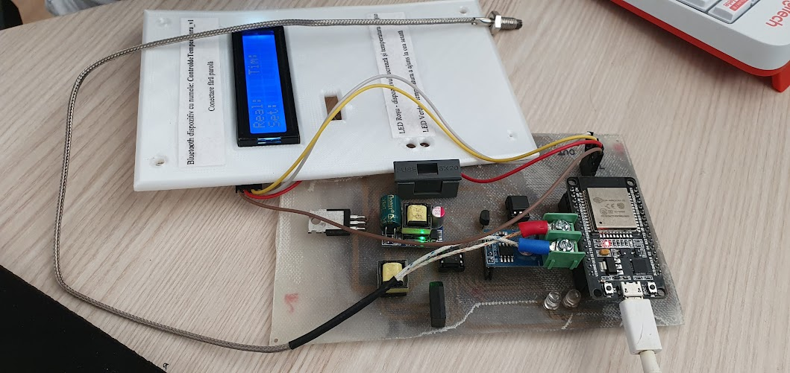
          </a>
          <a href="PrototipeNr2LUTCuperLayer.jpg" data-fancybox="stage-2">
            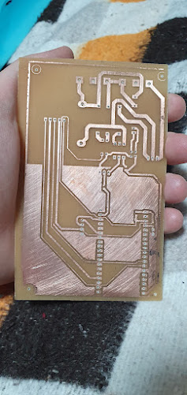
          </a>
          <a href="PrototipeNr2.jpg" data-fancybox="stage-2">
            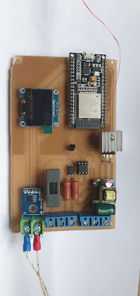
          </a>
          <a href="PrototipeNr2display.jpg" data-fancybox="stage-2">
            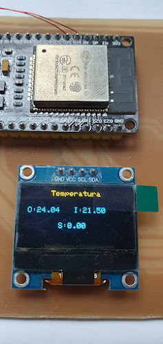
          </a>
        

      

    

  <!-- STAGE 3 -->
  

      

      

        <i class="fas fa-microchip"></i> Manufacturing Phase
        <h3 class="timeline-heading">Galvanic Isolation & JLCPCB Fabrication</h3>
        

          Designed an industrial-grade PCB manufactured by JLCPCB. Features full galvanic optocoupler isolation decoupling high-voltage 800W AC mains power from the low-voltage DC microcontroller section.
        

        

          <a href="Schematic_termicControl-for-fabrication_2026-06-11.png" data-fancybox="stage-3">
            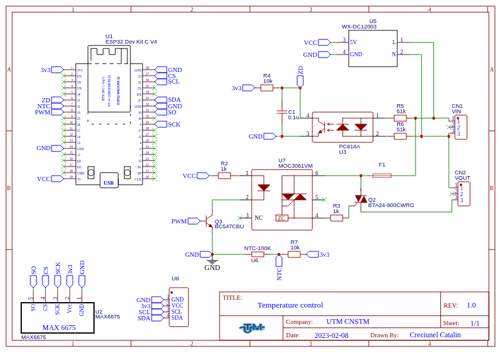
          </a>
          <a href="PCB_PCB_termicControl-copy_2026-06-11.png" data-fancybox="stage-3">
            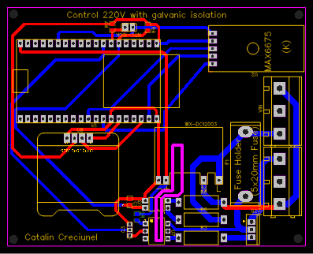
          </a>
          <a href="Photo-View_2026-06-11.svg" data-fancybox="stage-3">
            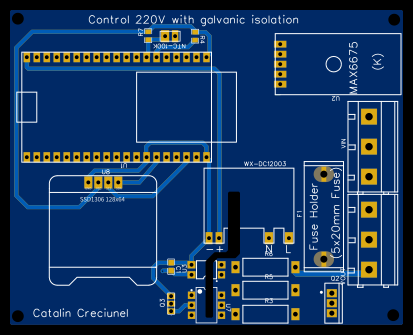
          </a>
        

      

    

  <!-- STAGE 4 -->
  

      

      

        <i class="fas fa-code"></i> Embedded Firmware
        <h3 class="timeline-heading">FreeRTOS Dual-Core & Async Web Dashboard</h3>
        

          Leveraged ESP32 dual cores: Core 0 executes deterministic 100ms PID control tasks and PWM firing; Core 1 hosts ESPAsyncWebServer streaming live temperature WebSockets, online tuning, and CSV data downloads.
        

        

          <a href="featured.jpg" data-fancybox="stage-4">
            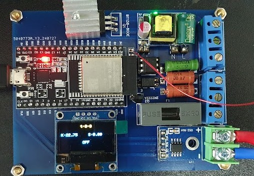
          </a>
          
          <a href="Setting_page.png" data-fancybox="stage-4">
            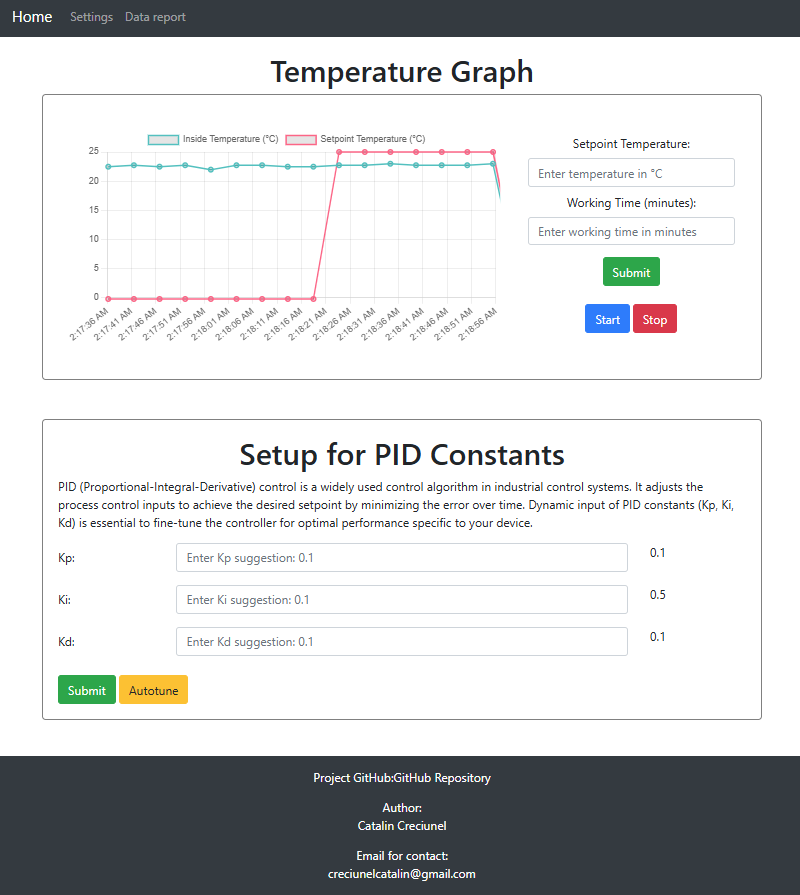
          </a>
          
        

      

    

  <!-- STAGE 5 -->
  

      

      

        <i class="fas fa-atom"></i> Practical Application
        <h3 class="timeline-heading">Zinc Oxide (ZnO) Thermal Oxidation</h3>
        

          Achieved precise $2Zn + O_2 \xrightarrow{\Delta T > 400^\circ C} 2ZnO$ thermal oxidation profiles. Tight PID regulation prevents structural defects and ensures reproducible wide-bandgap nanostructures.
        

      

    

  

---

## Interactive Atomic Oxidation Simulation



---

## Related Publications

* **[Thermal Treatment Control Systems](/publications/zinc-thermal-treatment-control/):** Remote-controlled temperature setup optimized for Zinc foil oxidation.
* **[Physics of Materials](/publications/pm8-conference/):** Optimized embedded solution designed to automate thermal treatment.
* **[Porous Gallium Oxide Nanostructures](/publications/porous-gallium-oxide-gap/):** Thermal oxidation methodology applied to wide-bandgap semiconductors ($GaP$ to $Ga_2O_3$).