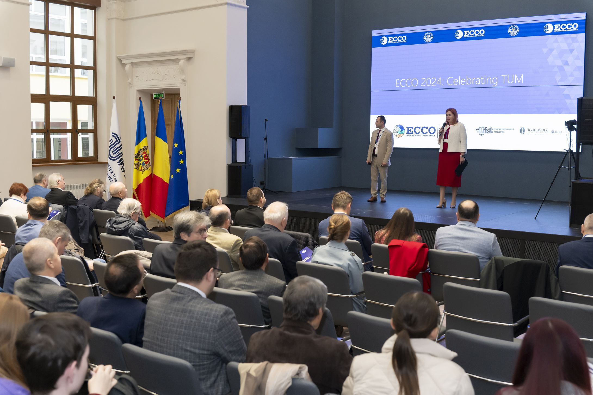
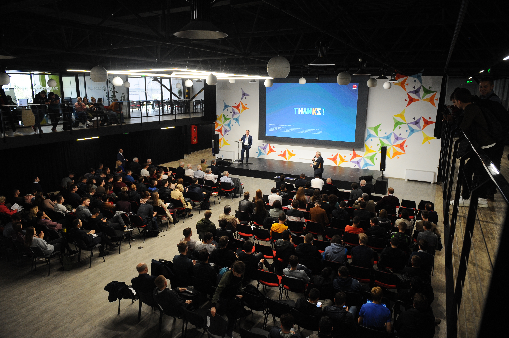

> [!NOTE]
> **Recognition:** This work was recognized as an **award-winning abstract** at the ECCO 2024 conference for its innovative approach to open-source laboratory instrumentation.

### System Architecture

The project stands out by applying modern software engineering principles to hardware development:

* **Real-Time Control:** Implementation of **FreeRTOS** on the Arduino Mega ensures that motor timing and high-voltage safety checks are never interrupted by UI updates.
* **DevOps for Hardware:** Use of **PlatformIO** and **GitHub Actions** allows for automated firmware building and testing, facilitating collaborative research.
* **Modular Design:** The system is designed to be easily adapted for different syringe types and high-voltage requirements.

### Conference Highlights

#### ECCO 2024 Presentation

  
  
  

#### Legacy: ECCO 2021

  
  

### Impact and Applications

By providing a low-cost yet precise alternative to industrial electrospinning units, this setup enables laboratories to:
1. **Accelerate Prototyping:** Rapidly test new polymer solutions for nanofibers.
2. **Collaborate:** Share and improve the control code via the open GitHub repository.
3. **Education:** Serve as a transparent platform for teaching embedded systems and materials science.

---
*This research was supported by the institutional subprogram #02.04.02 and the youth project #24.80012.5007.12TC.*